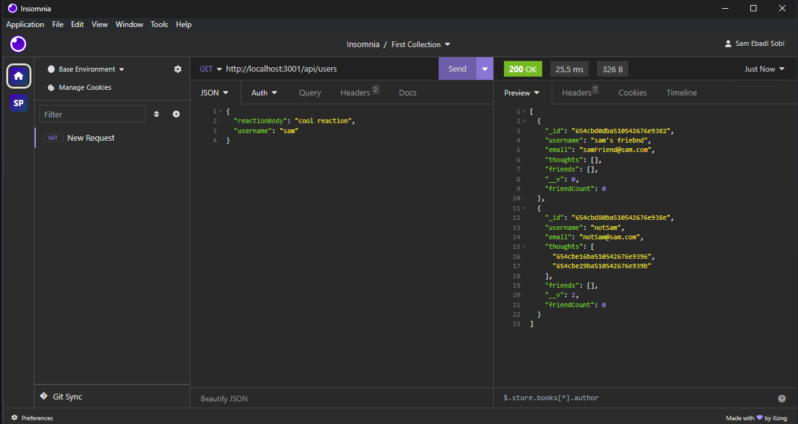

# Social Media API

[Walkthrough URL](https://drive.google.com/file/d/1_GdN2oU9d4s7isn71iVEeJr0sp3g2X6Q/view)

In this backend application, we can make api calls to different endpoints in order to get, put, post and delete some information. we can create users, thoughts and reactions and connect them to each other so that each users can have multiple thoughts and thoughts can have reactions.

## Some screenshots:

## 

## 

## 

This API was fully written by Sam Ebadi Sobi.
